Readme · MDCopy

Cyberpunk theme contribution for craftzdog/dotfiles-public
Startup dashboard · NETWATCH Oh My Posh prompt · Docker status · Zero breaking changes

What is this?
This repo contains a pull request proposal for Takuya's dotfiles.
It adds an optional cyberpunk-themed layer to the existing PowerShell setup — a single uncommented line activates it, and commenting it out reverts everything back to the original.
Nothing in the original user_profile.ps1 is broken or removed.

What it adds
FeatureDescriptionStartup dashboardSystem Info · Shortcuts · Features · Live Docker statusNETWATCH promptOh My Posh theme with git branch, path, user, execution timeWrite-CyberANSI helper — print any hex color in PowerShellGlobal palette $CYRestyle everything by editing 6 hex valuesShow-DashboardRe-run the dashboard at any timehelp-psFull help with tools, shortcuts and commands

How to activate
In user_profile.ps1, uncomment the last line:
powershell. "$PSScriptRoot\themes\cyberpunk\cyberpunk.ps1"
That's it. One line.

Structure
.config/powershell/
├── user_profile.ps1                ← original file + 1 optional line at the end
└── themes/
    └── cyberpunk/
        ├── cyberpunk.ps1           ← dashboard + NETWATCH prompt
        ├── omp_cyberpunk.json      ← Oh My Posh NETWATCH theme
        └── README.md               ← detailed docs

What it does NOT change

EditMode Emacs — preserved
Ctrl+F / Ctrl+R fzf chords — preserved
All existing aliases (g, ll, vim, grep, tig, less) — preserved
$env:GIT_SSH and PATH additions — preserved
posh-git module — preserved

Related

Full standalone version: HEO-80/powershell-cyberpunk

  PR proposal by <a href="https://github.com/HEO-80">HEO-80</a> · Héctor Oviedo

